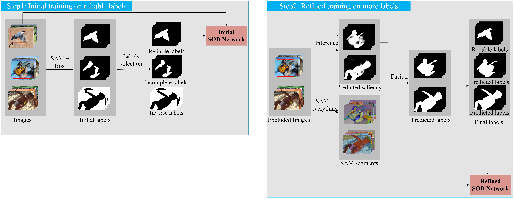

# Weakly supervised salient object detection via bounding-box annotation and SAM model


------


## Datasets
All datasets are available in public.

Download the DUTS-TR and DUTS-TE from [Here](http://saliencydetection.net/duts/#org3aad434). This is the training data please put it in `datasets/DUTS` . The datasets structure is shown below. Follow the prompt to create a folder of datasets.

```

├─datasets
│  ├─DUTS
│  │  ├─DUTS-TE
│  │  │  ├─DUTS-TE-Image
│  │  │  └─DUTS-TE-Mask
│  │  └─DUTS-TR
│  │      ├─DUTS-TR-Image
│  │      └─DUTS-TR-Mask
│  ├─excluded
│  │  ├─error
│  │  ├─everthing
│  │  ├─image
│  │  ├─infer
│  │  ├─mask
│  │  ├─mask_images
│  │  └─output
│  ├─initial
│  │  ├─image
│  │  └─mask
│  └─refined
│      ├─image
│      └─mask


```

The other three evaluation datasets can be found below:

* Download the DUT-OMRON from [Here](http://saliencydetection.net/dut-omron/#org96c3bab)
* Download the HKU-IS from [Here](https://sites.google.com/site/ligb86/hkuis)
* Download the ECSSD from [Here](https://www.cse.cuhk.edu.hk/leojia/projects/hsaliency/dataset.html)

## Requirements

1. Run the following command to install the base library.

   ```
   pip install -r requestment.txt
   ```

2. Go to the official [SAM Github](https://github.com/facebookresearch/segment-anything) to install Segment Anything.

## Run

### Step1: Initial Stage

```shell

# Get initial reliable pseudo-labels
python process/sam_box.py
python process/miou_remove.py

# Matches the image corresponding to mask
python process/copy_matched.py

# Training the initial SOD netwoek, 'datasets/initial/' as the training set
pthon train_base.py -save_tar initial
```

### Step2: Refined Stage

```shell

# The excluded mask is saved in 'datasets/excluded/mask/' and matches the corresponding images that save in 'datasets/excluded/mask_images'. 
# Please modify tar_dir and out_dir before operation
python process/copy_matched.py

# Use the initial SOD network trained in the step 1 to infer the excluded images which in 'datasets/excluded/mask_images' to save in 'datasets/excluded/infer'
python infer_sal.py -load_path runs/initial/model_best.pth

# Optimize the excluded masks
python process/excluded_prediction.py

# Please modify masks_path='datasets/excluded/output' and out_dir='datasets/excluded/error' before operation
python process/miou_remove.py

# Matches the image corresponding to output.
# Please modify tar_dir = 'datasets/excluded/output',out_dir = 'datasets/excluded/image' before operation
python process/copy_matched.py

# The refined training set is obtained by merging 'datasets/excluded/image' and 'datasets/excluded/output' with 'datasets/initial/image' and 'datasets/initial/mask', respectively

# To get refined SOD network use the final training set above.
python train_base.py  -save_tar refined
# To get final SOD network use the final training set above.
python rate_train.py  -save_tar final

```
